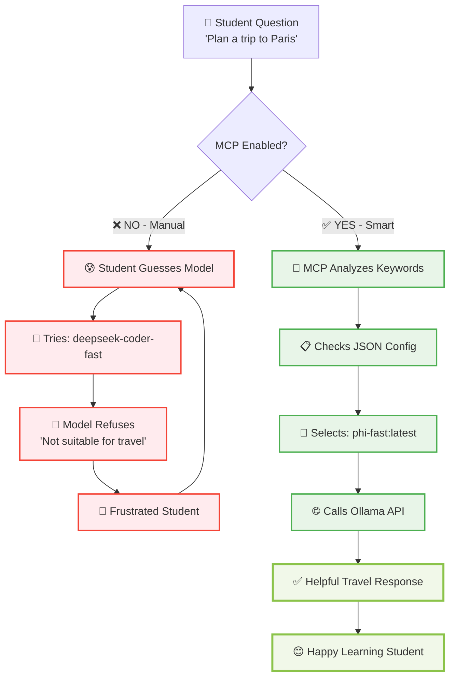
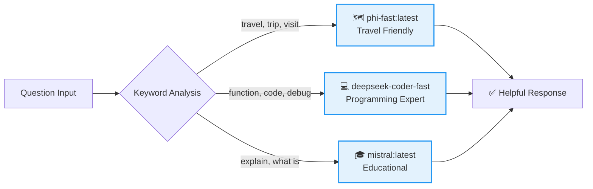
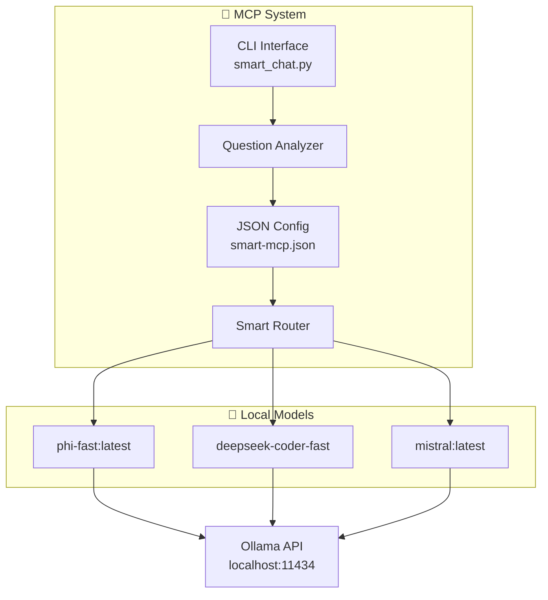

# MCP Flow Diagram for README

## Simple Flow for GitHub README

```mermaid
graph TD
    A[👤 Student Question<br/>'Plan a trip to Paris'] --> B{MCP Enabled?}
    
    %% Before MCP Path
    B -->|❌ NO - Manual| C[😰 Student Guesses Model]
    C --> D[🎲 Tries: deepseek-coder-fast]
    D --> E[🚫 Model Refuses<br/>'Not suitable for travel']
    E --> F[😤 Frustrated Student]
    F --> C
    
    %% After MCP Path  
    B -->|✅ YES - Smart| G[🧠 MCP Analyzes Keywords]
    G --> H[📋 Checks JSON Config]
    H --> I[🎯 Selects: phi-fast:latest]
    I --> J[🌐 Calls Ollama API]
    J --> K[✅ Helpful Travel Response]
    K --> L[😊 Happy Learning Student]
    
    %% Styling
    classDef problem fill:#ffebee,stroke:#f44336,stroke-width:2px
    classDef solution fill:#e8f5e8,stroke:#4caf50,stroke-width:2px
    classDef success fill:#f1f8e9,stroke:#8bc34a,stroke-width:3px
    
    class C,D,E,F problem
    class G,H,I,J solution
    class K,L success
```

## Model Selection Logic

```mermaid
graph LR
    A[Question Input] --> B{Keyword Analysis}
    
    B -->|travel, trip, visit| C[🗺️ phi-fast:latest<br/>Travel Friendly]
    B -->|function, code, debug| D[💻 deepseek-coder-fast<br/>Programming Expert]  
    B -->|explain, what is| E[🎓 mistral:latest<br/>Educational]
    
    C --> F[✅ Helpful Response]
    D --> F
    E --> F
    
    classDef models fill:#e3f2fd,stroke:#2196f3,stroke-width:2px
    class C,D,E models
```

## System Architecture

```mermaid
graph TB
    subgraph "🎯 MCP System"
        A[CLI Interface<br/>smart_chat.py]
        B[Question Analyzer]
        C[JSON Config<br/>smart-mcp.json]
        D[Smart Router]
    end
    
    subgraph "🤖 Local Models"
        E[phi-fast:latest]
        F[deepseek-coder-fast]
        G[mistral:latest]
    end
    
    H[Ollama API<br/>localhost:11434]
    
    A --> B
    B --> C
    C --> D
    D --> E
    D --> F
    D --> G
    E --> H
    F --> H
    G --> H
```
