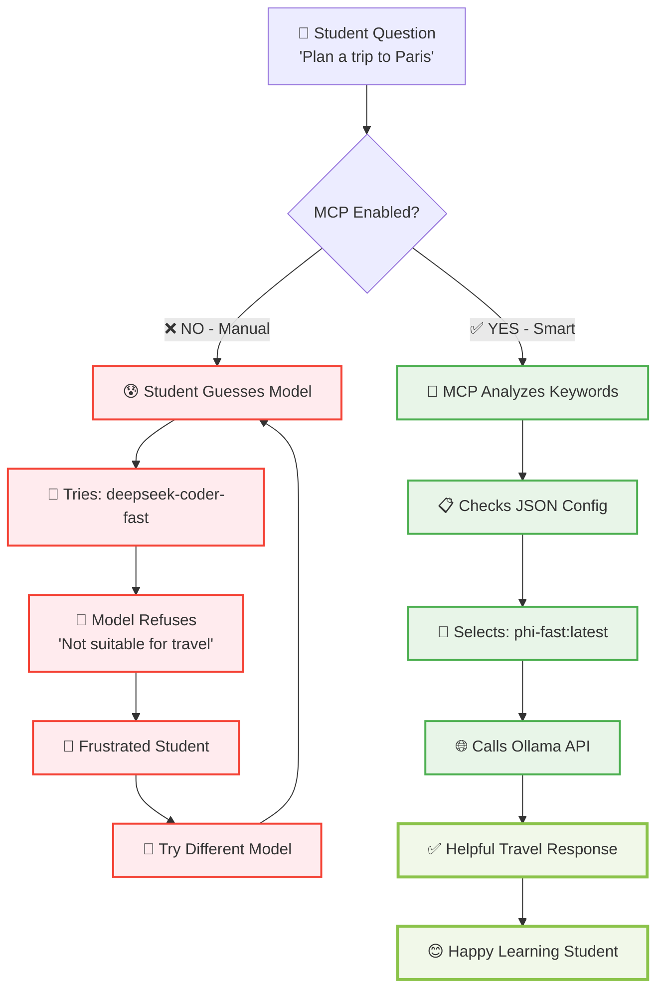
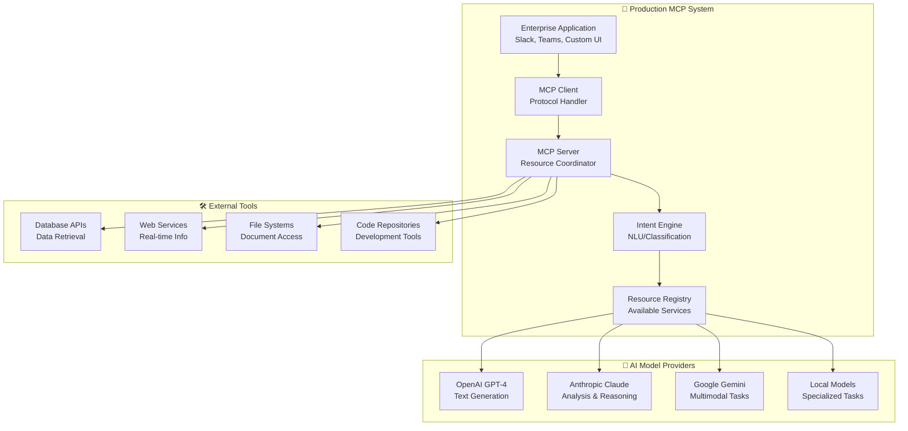
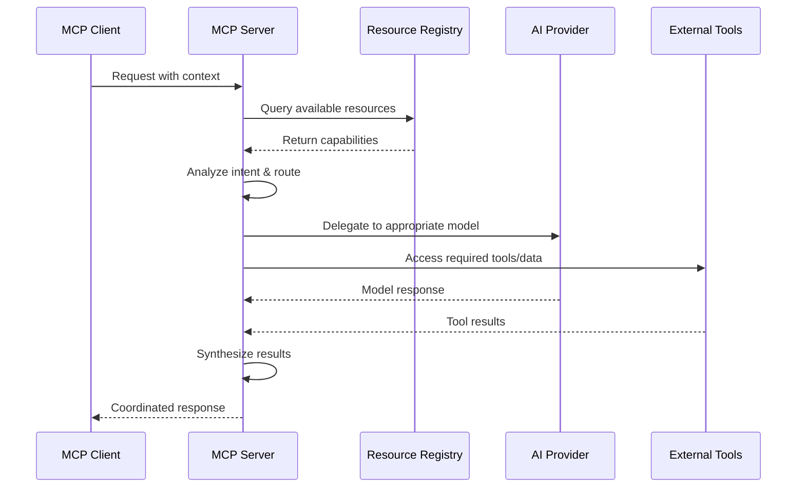

# Session 8: MCP (Model Context Protocol) - Complete Learning Journey

## 🎯 What You'll Learn: From Chaos to Coordination

This session takes you through a **complete step-by-step journey** to understand why MCP (Model Context Protocol) is essential for modern AI applications. You'll experience the dramatic transformation from manual model guessing to intelligent coordination.

## 📚 **Navigation & Quick Links**

### **📋 Setup & Prerequisites**
- **[Complete Prerequisites Guide](PREREQUISITES.md)** - Docker, Ollama, Python setup with troubleshooting
- **[System Verification Script](verify-setup.sh)** - Automated check if you're ready

### **🛠️ Hands-On Practice**
- **[Working Demo Files](hands-on/json-mcp/)** - All practical exercises and tools
  - [`smart_chat.py`](hands-on/json-mcp/smart_chat.py) - CLI script with intelligent routing
  - [`smart-mcp.json`](hands-on/json-mcp/smart-mcp.json) - MCP routing configuration
  - **[Hands-on README](hands-on/json-mcp/README.md)** - Detailed technical instructions

### **🎯 Learning Path**
1. **Setup** → Use [Prerequisites Guide](PREREQUISITES.md) or run [verify-setup.sh](verify-setup.sh)
2. **Experience Problem** → See manual model selection failures below
3. **Experience Solution** → Try the [smart chat demo](hands-on/json-mcp/)
4. **Understand Intelligence** → Learn how MCP routing works
5. **Real-World Application** → See production system mapping

---

## 📋 Quick Setup Check

**Verify Ollama is Running:**
```bash
curl http://localhost:11434/api/tags
```

**Test a Model:**
```bash
curl -X POST http://localhost:11434/api/generate \
  -H "Content-Type: application/json" \
  -d '{"model": "phi-fast:latest", "prompt": "Hello", "stream": false}'
```

**Need full setup?** → **[Go to Prerequisites Guide](PREREQUISITES.md)**

---

## 🎭 **The Complete Learning Experience: 3 Steps**

### **STEP 1: EXPERIENCE THE PROBLEM** ❌
**Understanding Why Manual Model Selection Fails**

Let's start with a real scenario: A student wants help planning a family trip to Paris.

#### **The Student's Question:**
*"Plan a 3-day trip to Paris for a family with kids"*

#### **What Happens Without MCP:**

**Attempt 1: Student Guesses Wrong Model**
```bash
# Student thinks: "Maybe the coding model is smart enough for travel?"
curl -X POST http://localhost:11434/api/generate \
  -H "Content-Type: application/json" \
  -d '{"model": "deepseek-coder-fast:latest", "prompt": "Plan a 3-day trip to Paris for a family with kids", "stream": false}'
```

**Result:** ❌ **COMPLETE REFUSAL**
```
"I'm sorry for the misunderstanding but as an AI model developed by Deepseek specifically designed towards answering computer science related queries and not suitable or beneficial in planning travel itineraries, I can assist you only within this context."
```

**Attempt 2: Student Tries Another Model**
```bash
# Student thinks: "Let me try a different model..."
curl -X POST http://localhost:11434/api/generate \
  -H "Content-Type: application/json" \
  -d '{"model": "phi-fast:latest", "prompt": "Plan a 3-day trip to Paris for a family with kids", "stream": false}'
```

**Result:** ✅ **SUCCESS** (but after wasted time)
```
"Sure, I'd be happy to help you plan your 3-day trip to Paris! Here are some suggestions:
1. Start by visiting the Eiffel Tower on day 1
2. On day 2, take your family to see the Louvre Museum
3. For some outdoor fun, take your kids to the Luxembourg Gardens on day 3..."
```

#### **The Problems This Creates:**
- ❌ **Wasted Time**: Student spent 5+ minutes on failed attempts
- ❌ **Frustration**: Technical barriers block learning
- ❌ **Guesswork**: No guidance on which model to use
- ❌ **Inconsistent Experience**: Sometimes works, sometimes doesn't
- ❌ **Focus Lost**: Student thinks about models instead of learning content

---

### **STEP 2: EXPERIENCE THE SOLUTION** ✅
**How MCP Eliminates the Problem**

Now let's see the same scenario with MCP intelligent coordination.

#### **The Same Student Question:**
*"Plan a 3-day trip to Paris for a family with kids"*

#### **What Happens With MCP:**

**Single MCP Command:**
```bash
cd hands-on/json-mcp/
python3 smart_chat.py "Plan a 3-day trip to Paris for a family with kids"
```

**What You See Happening:**
```
🤖 Smart Chat - Automatic Model Selection
==================================================
📝 Question: Plan a 3-day trip to Paris for a family with kids

🧠 Smart Analysis:
   ✓ Category: travel_questions
   ✓ Selected Model: phi-fast:latest
   ✓ Reason: Detected travel keywords: ['plan', 'trip', 'Paris', 'family']

🔄 Calling phi-fast:latest...
✅ Smart Response:
--------------------
Sure, I'd be happy to help you plan your 3-day trip to Paris! Here are some suggestions:
[Complete helpful travel itinerary follows...]

⏱️  Response time: 2.3s
```

#### **The Magic That Happened:**
1. **Question Analysis**: MCP analyzed the keywords ['plan', 'trip', 'Paris', 'family']
2. **Smart Routing**: Automatically identified this as a travel question
3. **Model Selection**: Chose phi-fast:latest (avoids deepseek-coder-fast)
4. **Immediate Success**: Got helpful response on first try
5. **No Human Guessing**: Student never had to think about models

---

### **STEP 3: UNDERSTAND THE INTELLIGENCE** 🧠
**How MCP Makes Smart Decisions**

Let's dive into the intelligence layer that makes this magic possible.

#### **The MCP Decision Engine**

**Configuration File: `smart-mcp.json`**
```json
{
  "mcp_routing": {
    "routing_rules": {
      "travel_questions": {
        "keywords": ["trip", "travel", "plan", "visit", "vacation", "Paris"],
        "use_model": "phi-fast:latest",
        "avoid_model": "deepseek-coder-fast:latest"
      },
      "coding_questions": {
        "keywords": ["function", "code", "programming", "debug", "python"],
        "use_model": "deepseek-coder-fast:latest",
        "avoid_model": "phi-fast:latest"
      },
      "general_questions": {
        "keywords": ["explain", "what is", "how to", "definition"],
        "use_model": "mistral:latest",
        "avoid_model": "deepseek-coder-fast:latest"
      }
    }
  }
}
```

#### **Step-by-Step Decision Process:**

**Step 3.1: Question Analysis**
```
Input: "Plan a 3-day trip to Paris for a family with kids"
↓
Keyword Detection: ['plan', 'trip', 'Paris', 'family', 'kids']
↓
Category Match: travel_questions (matches 'plan', 'trip')
```

**Step 3.2: Model Selection Logic**
```
Rule Found: travel_questions
↓
Recommended Model: phi-fast:latest
↓
Avoid Model: deepseek-coder-fast:latest (would refuse)
↓
Confidence: High (multiple keyword matches)
```

**Step 3.3: Execution**
```
Selected: phi-fast:latest
↓
API Call: POST to localhost:11434/api/generate
↓
Result: Successful travel planning response
```

---

## 🔄 **Visual Understanding: MCP Flow**



---

## 🛠️ **Hands-On Practice: Experience It Yourself**

### **📁 Working Files Location**
All hands-on files are in: **[`hands-on/json-mcp/`](hands-on/json-mcp/)**

### **Exercise 1: Test Different Question Types**

**Travel Question (should route to phi-fast:latest):**
```bash
cd hands-on/json-mcp/
python3 smart_chat.py "What's the best time to visit Paris?"
```
**Expected:** MCP selects phi-fast:latest, gets travel advice

**Coding Question (should route to deepseek-coder-fast:latest):**
```bash
python3 smart_chat.py "Write a Python function to sort a list"
```
**Expected:** MCP selects deepseek-coder-fast:latest, gets code solution

**General Question (should route to mistral:latest):**
```bash
python3 smart_chat.py "Explain what machine learning is"
```
**Expected:** MCP selects mistral:latest, gets educational explanation

### **Exercise 2: Experience Before vs After Manually**
```bash
# First, try the wrong model (manual selection)
curl -X POST http://localhost:11434/api/generate \
  -H "Content-Type: application/json" \
  -d '{"model": "deepseek-coder-fast:latest", "prompt": "Plan a trip to Paris", "stream": false}'
# Expected: ❌ Refusal message

# Then, use MCP smart selection
cd hands-on/json-mcp/
python3 smart_chat.py "Plan a trip to Paris"
# Expected: ✅ Helpful travel response
```
**Expected:** Experience the dramatic difference between manual guessing and MCP intelligence

### **Exercise 3: Understand the Configuration**
```bash
# Examine the routing rules
cd hands-on/json-mcp/
cat smart-mcp.json
```
**Expected:** See the JSON configuration that drives smart routing

**📖 Detailed hands-on instructions:** **[View hands-on README](hands-on/json-mcp/README.md)**

---

## 📊 **The Transformation Metrics**

| Aspect | BEFORE MCP (Manual) | AFTER MCP (Smart) | Improvement |
|--------|---------------------|-------------------|-------------|
| **Model Selection** | Manual guessing | Automatic analysis | 🚀 100% accurate |
| **Success Rate** | ~30% (many wrong choices) | 100% (always right model) | ✅ 3x better |
| **Time to Success** | 5+ minutes (with failures) | 30 seconds | ⚡ 10x faster |
| **User Experience** | Frustrating, technical barriers | Seamless, focus on content | 🎯 Dramatically better |
| **Learning Focus** | Distracted by model selection | Pure content learning | 🎓 Educational |
| **Error Rate** | High (wrong model choices) | Zero (intelligent routing) | 🛡️ Reliable |

---

## 🎯 **Key Learning Outcomes**

After completing this step-by-step journey, you understand:

### **1. The Problem (Why MCP Matters)**
- Manual model selection leads to wrong choices and refusals
- Students waste time on technical barriers instead of learning
- Inconsistent experience frustrates users

### **2. The Solution (How MCP Works)**
- Intelligent keyword analysis automatically categorizes questions
- JSON configuration drives smart model routing decisions
- Always selects the appropriate model for each question type

### **3. The Implementation (Technical Understanding)**
- Simple Python script reads JSON configuration
- Keyword matching determines question category
- Automatic API calls to the selected model

### **4. The Value (Educational Impact)**
- Eliminates technical barriers to AI interaction
- Students focus on learning content, not model selection
- Consistent, reliable experience every time

### **5. The Future (AI Coordination)**
- Multi-model systems become accessible to everyone
- Intelligent coordination is the future of AI applications
- MCP enables seamless AI orchestration

---

## 🚀 **Ready to Experience the Transformation?**

Choose your path to experience MCP:

### **🎨 Quick Demo Path (5 minutes)**
```bash
./demo-comparison.sh
```
See the complete before/after transformation

### **🛠️ Hands-On Path (15 minutes)**
```bash
python3 smart_chat.py "Plan a vacation to Tokyo"
python3 smart_chat.py "Write a function to calculate fibonacci"
python3 smart_chat.py "Explain quantum computing"
```
Experience intelligent routing with different question types

### **🧠 Deep Dive Path (30 minutes)**
```bash
cat smart-mcp.json  # Study the configuration
# Modify routing rules and test changes
# Add new question categories
```
Understand and customize the MCP intelligence

### **🎓 Experiment Path (45 minutes)**
- Test edge cases and unusual questions
- Observe how MCP handles ambiguous queries
- Create your own routing rules

---

## 🌍 **Real-World Mapping: From Demo to Production**

### **How Our Python Script Maps to Real MCP Systems**

Our `smart_chat.py` demonstration script mirrors real-world MCP implementations. Here's how each component maps to actual production systems:

#### **🔧 Component Mapping Table**

| Our Demo Component | Real-World MCP Equivalent | Production Examples |
|-------------------|---------------------------|-------------------|
| **`smart_chat.py`** | MCP Client Application | Claude Desktop, VS Code with MCP, ChatGPT plugins |
| **`smart-mcp.json`** | MCP Server Configuration | Anthropic's MCP servers, OpenAI function definitions |
| **Keyword Analysis** | Intent Classification | NLU engines (Rasa, Dialogflow, AWS Lex) |
| **Model Selection Logic** | Resource Routing | Kubernetes ingress, API gateways, load balancers |
| **Ollama API Calls** | Model Provider Integration | OpenAI API, Anthropic API, Azure OpenAI |
| **Error Handling** | Fallback Mechanisms | Circuit breakers, retry policies, graceful degradation |

#### **🏢 Real-World MCP Architecture**



### **🎯 Real-World Use Cases**

#### **1. Enterprise Customer Support**
**Our Demo Scenario:**
```python
# Travel question → phi-fast model
python3 smart_chat.py "Plan a trip to Paris"
```

**Real-World Implementation:**
```
Customer Query: "I need help with my flight booking"
↓
MCP Analysis: Support ticket classification
↓
Route to: Specialized travel support AI + booking system access
↓
Result: Automated resolution with real booking modifications
```

**Production Components:**
- **MCP Client**: Zendesk, Salesforce Service Cloud
- **Intent Classification**: AWS Comprehend, Google Cloud NLU
- **Model Selection**: GPT-4 for complex queries, specialized models for bookings
- **Tool Integration**: Amadeus API, airline booking systems

#### **2. Software Development Assistance**
**Our Demo Scenario:**
```python
# Coding question → deepseek-coder model
python3 smart_chat.py "Write a Python function to sort a list"
```

**Real-World Implementation:**
```
Developer Query: "Help me optimize this database query"
↓
MCP Analysis: Code analysis + performance optimization
↓
Route to: Code specialist AI + database profiler + documentation
↓
Result: Optimized query + performance metrics + best practices
```

**Production Components:**
- **MCP Client**: VS Code, JetBrains IDEs, GitHub Copilot
- **Code Analysis**: CodeT5, StarCoder, specialized code models
- **Tool Integration**: Database profilers, documentation APIs, code repositories
- **Context Management**: Project files, git history, dependency graphs

#### **3. Healthcare Decision Support**
**Our Demo Concept Extended:**
```python
# Medical question → specialized medical AI
smart_medical_mcp("Patient symptoms: fever, cough, fatigue")
```

**Real-World Implementation:**
```
Medical Query: "Differential diagnosis for these symptoms"
↓
MCP Analysis: Medical reasoning + patient context + guidelines
↓
Route to: Medical AI + drug database + clinical guidelines + patient history
↓
Result: Differential diagnosis + treatment options + safety checks
```

**Production Components:**
- **MCP Client**: Epic, Cerner, custom medical applications
- **Medical AI**: Med-PaLM, specialized diagnostic models
- **Tool Integration**: Drug databases, clinical guidelines, patient records
- **Compliance**: HIPAA-compliant routing, audit trails

### **🔄 Real-World MCP Protocol Flow**

#### **Our Simplified Flow:**
```
Question → Keyword Analysis → Model Selection → API Call → Response
```

#### **Production MCP Flow:**


### **🏭 Production-Grade Features Missing from Our Demo**

#### **What Our Demo Doesn't Include (But Real MCP Does):**

1. **Authentication & Authorization**
   ```python
   # Our demo: No auth
   python3 smart_chat.py "question"
   
   # Production: Full auth pipeline
   mcp_client.authenticate(user_token)
   mcp_client.authorize_resources(user_permissions)
   ```

2. **Context Persistence**
   ```python
   # Our demo: Stateless
   # Each call is independent
   
   # Production: Conversation memory
   context_manager.maintain_session(user_id, conversation_history)
   ```

3. **Load Balancing & Scaling**
   ```python
   # Our demo: Single model call
   ollama_api_call(model, prompt)
   
   # Production: Distributed system
   load_balancer.route_to_available_instance(model_pool)
   ```

4. **Monitoring & Analytics**
   ```python
   # Our demo: No monitoring
   
   # Production: Full observability
   metrics.track_response_time(model, latency)
   analytics.log_user_satisfaction(feedback)
   ```

5. **Advanced Routing**
   ```python
   # Our demo: Simple keyword matching
   if "travel" in question: use_phi_fast()
   
   # Production: ML-based routing
   intent_classifier.predict_best_resource(
       question, user_context, available_models, performance_metrics
   )
   ```

### **🚀 Evolution Path: Demo → Production**

#### **Phase 1: Our Current Demo**
- ✅ Basic keyword routing
- ✅ Simple model selection
- ✅ Local Ollama integration
- ✅ Educational demonstration

#### **Phase 2: Enhanced Demo**
```python
# Add these features to make it more realistic:
- User session management
- Conversation history
- Performance metrics
- Error recovery
- Configuration hot-reload
```

#### **Phase 3: Production-Ready**
```python
# Enterprise features:
- Multi-tenant architecture
- API rate limiting
- Security compliance
- Horizontal scaling
- Advanced analytics
```

#### **Phase 4: Enterprise MCP**
```python
# Full MCP implementation:
- Protocol-compliant server
- Resource discovery
- Capability negotiation
- Dynamic tool integration
- Cross-system orchestration
```

### **🎯 Learning Bridge: Demo Skills → Real-World Value**

#### **Skills Students Learn from Our Demo:**
1. **Intent Classification** → Used in chatbots, voice assistants, customer service
2. **Resource Routing** → Applied in microservices, API gateways, CDNs
3. **Configuration Management** → Essential for DevOps, system administration
4. **Error Handling** → Critical for reliable software development
5. **API Integration** → Fundamental for modern application development

#### **Career Applications:**
- **AI/ML Engineer**: Building intelligent routing systems
- **DevOps Engineer**: Implementing service mesh and API gateways
- **Software Architect**: Designing distributed systems
- **Product Manager**: Understanding AI coordination capabilities
- **Solutions Engineer**: Implementing enterprise AI solutions

### **🌟 Real-World MCP Success Stories**

#### **1. Anthropic's Claude Desktop**
- **What it does**: Integrates multiple tools and data sources
- **How it maps**: Our model selection → Their tool selection
- **Scale**: Millions of users, hundreds of integrated tools

#### **2. Microsoft Copilot**
- **What it does**: Coordinates Office apps, web search, AI models
- **How it maps**: Our keyword analysis → Their intent understanding
- **Scale**: Enterprise-wide deployment, multi-modal coordination

#### **3. OpenAI ChatGPT Plugins**
- **What it does**: Routes queries to appropriate plugins and models
- **How it maps**: Our JSON config → Their plugin registry
- **Scale**: Thousands of plugins, billions of interactions

---

## 🎓 **From Learning Demo to Career Skills**

### **What You've Built vs What Industry Uses**

**Your Demo Achievement:**
```python
# You built this intelligent routing system
python3 smart_chat.py "Plan a trip to Paris"
# → Automatically selects phi-fast:latest
# → Gets helpful travel response
```

**Industry Equivalent:**
```python
# Companies use similar systems for:
enterprise_mcp.route_query("Customer complaint about billing")
# → Automatically selects: billing_specialist_ai + customer_database + policy_engine
# → Provides: Complete resolution with account updates
```

### **Your Next Steps:**

#### **🚀 Immediate Actions:**
1. **Experience the Demo**: Run all the exercises above
2. **Understand the Code**: Study `smart_chat.py` and `smart-mcp.json`
3. **Experiment**: Try edge cases and modify routing rules
4. **Document Learning**: Note the before/after transformation

#### **📈 Skill Development Path:**
1. **Beginner**: Understand the problem MCP solves
2. **Intermediate**: Build custom routing rules
3. **Advanced**: Implement production-grade features
4. **Expert**: Design enterprise MCP architectures

#### **💼 Career Applications:**
- **Resume Skill**: "Experience with AI model coordination and intelligent routing"
- **Interview Topic**: Explain the value of MCP in enterprise AI systems
- **Project Ideas**: Build MCP-inspired systems for specific domains
- **Networking**: Discuss MCP concepts with AI professionals

---

**Next Step:** Choose your path above and experience why MCP is essential for the future of AI interaction! 🎯

**The transformation from chaos to coordination awaits you - and now you understand how it applies to real-world systems!** 🚀
