# Session 8: MCP (Model Context Protocol) - Before vs After Demo

## 🎯 Experience the Transformation

See how MCP eliminates the frustration of manual model selection and makes AI coordination intelligent.

## 📋 Quick Setup

**Verify Ollama is Running:**
```bash
curl http://localhost:11434/api/tags
```

**Test a Model:**
```bash
curl -X POST http://localhost:11434/api/generate \
  -H "Content-Type: application/json" \
  -d '{"model": "phi-fast:latest", "prompt": "Hello", "stream": false}'
```

---

## 🎭 **The Problem vs Solution**

### **❌ BEFORE MCP: Manual Guessing**

```bash
# Student tries wrong model
curl -X POST http://localhost:11434/api/generate \
  -d '{"model": "deepseek-coder-fast:latest", "prompt": "Plan a trip to Paris"}'

# Result: ❌ "I'm sorry... not suitable for travel itineraries"
```

**Problems:**
- Manual model guessing
- Wrong choices = Refusals  
- Wasted time and frustration

### **✅ AFTER MCP: Smart Selection**

```bash
# MCP automatically picks the right model
python3 smart_chat.py "Plan a trip to Paris"

# Result: ✅ Helpful travel planning response
```

**Benefits:**
- Automatic model selection
- Always picks the right model
- Immediate success

---

## 🔄 **How MCP Works**

```mermaid
graph TD
    A[👤 Student Question] --> B{MCP Analysis}
    
    B -->|travel keywords| C[🗺️ phi-fast:latest]
    B -->|coding keywords| D[💻 deepseek-coder-fast]  
    B -->|general keywords| E[🎓 mistral:latest]
    
    C --> F[✅ Helpful Response]
    D --> F
    E --> F
```



**Smart Routing Rules:**

| Keywords | Selected Model | Why |
|----------|----------------|-----|
| trip, travel, visit | phi-fast:latest | Good for travel questions |
| function, code, debug | deepseek-coder-fast | Programming specialist |
| explain, what is | mistral:latest | Good for explanations |

---

## 🛠️ **Try It Yourself**

### **Step 1: Test Different Question Types**

```bash
cd hands-on/json-mcp/

# Travel question → phi-fast
python3 smart_chat.py "What's the best time to visit Paris?"

# Coding question → deepseek-coder-fast  
python3 smart_chat.py "Write a Python function to sort a list"

# General question → mistral
python3 smart_chat.py "Explain what machine learning is"
```

### **Step 2: See the Before/After Demo**
```bash
./demo-comparison.sh
```

---

## 📊 **The Dramatic Difference**

| Aspect | Manual Selection | MCP Selection |
|--------|------------------|---------------|
| **Success Rate** | ~30% (lots of wrong choices) | 100% (always right) |
| **Time** | 5+ minutes with failures | 30 seconds |
| **Experience** | Frustrating | Seamless |

---

## 🎯 **What You Learn**

1. **The Problem**: Manual model selection often fails
2. **The Solution**: MCP automatically picks the right model  
3. **The Value**: Focus on learning, not technical barriers
4. **The Future**: Intelligent AI coordination

---

**Ready to experience the transformation?** Run the commands above and see MCP eliminate the guesswork! 🚀
